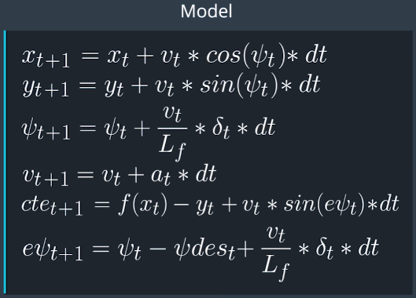

# CarND-Controls-MPC
Self-Driving Car Engineer Nanodegree Program
---
## Reflection

1. The Model.Student describes their model in detail. This includes the state, actuators and update equations.

The vehicle model used here was the kinematic model, a simplify version of dynamic model that ignore tire forces, gravity and mass. The model consists of the following equation:

 [x(position), y(position), ψ(orientation angle), v(velocity), cte(cross-track error), eψ(orientation error)] is the state of the vehicle, Lf is a physical characteristic of the vehicle, and [δ (steering angle),a (acceleration)] are the actuators.

2. Timestep Length and Elapsed Duration (N & dt). Student discusses the reasoning behind the chosen N (timestep length) and dt (elapsed duration between timesteps) values.

Even though I was using the suggested value from the Udacity Project Q&A I tried different values for N and dt to have a better understanding the impact on the performance of my MPC. When I was using high value of N =20 it took longer to get the result as is more computationally expensive. Also using small of dt I increased resolution so more precise on my estimation.

These two parameters combined N*dt allow to define the response time for my controller.
For high speed (>60MPH)  I need quick response from my controller so final settings were N=10 and dt=0.1  

3. Polynomial Fitting and MPC Preprocessing. If the student preprocesses waypoints, the vehicle state, and/or actuators prior to the MPC procedure it is described.

To help on the 3rd degree polynomial fit and math reduction during the MPC evaluation, the waypoints were transformed to the vehicle origin reference system. Also the orientation angle was rotate to initialize the value as zero.

4. Model Predictive Control with Latency. The student implements Model Predictive Control that handles a 100 millisecond latency. Student provides details on how they deal with latency.

To mimic the real driving condition a 100ms latency was added. To handle the delay, It was used the kinematic equations to predict the states after 100ms before sending them to MPC. In this way the model is forward in time improving the accuracy of the model. Finally, it was replaced the initial state with the predicted state. This idea was suggested from the Udacity Project Q&A.
